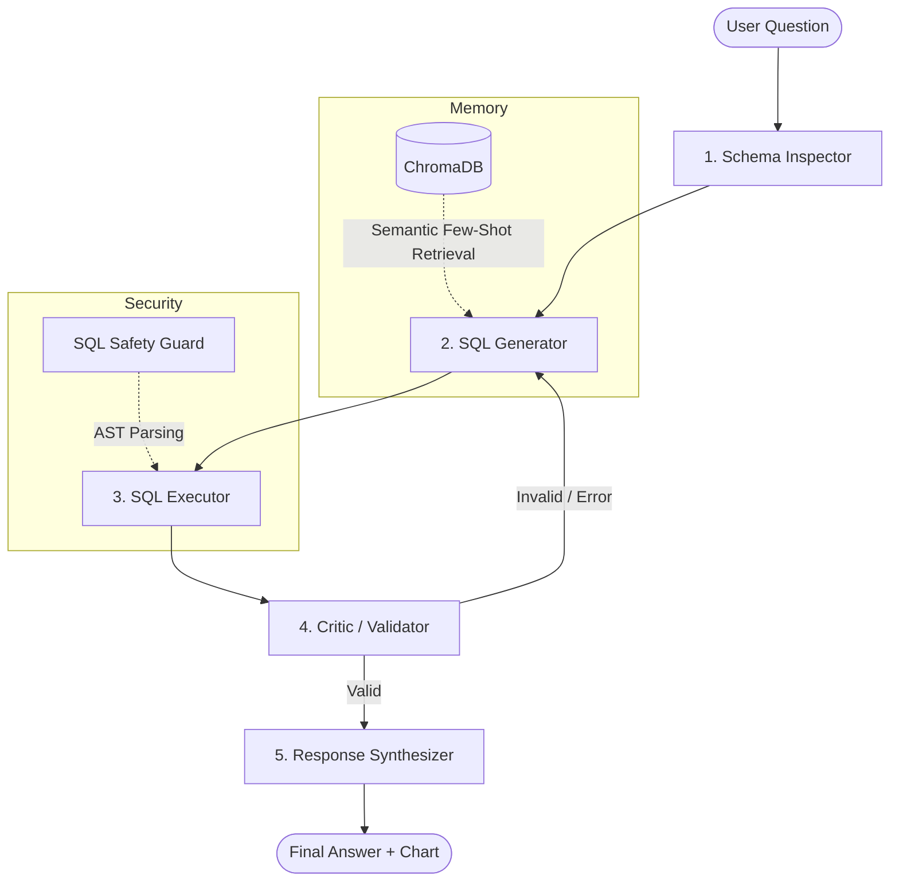
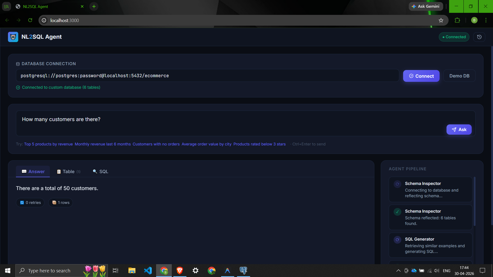

<div align="center">
  
  <h1>NL2SQL Autonomous Agent</h1>
  <p><strong>A 5-Agent LangGraph Pipeline for Natural Language to SQL Translation, Execution, and Visualization</strong></p>
  
  [](https://fastapi.tiangolo.com/)
  [](https://www.langchain.com/)
  [](https://langchain-ai.github.io/langgraph/)
  [](https://reactjs.org/)
  [](https://www.postgresql.org/)
  [](https://www.trychroma.com/)
</div>

<br/>

NL2SQL Agent is an advanced, autonomous AI pipeline that allows users to query complex PostgreSQL databases using plain English. Built with **LangGraph**, it features a multi-agent architecture with built-in self-correction (Critic Validator), semantic few-shot learning (ChromaDB), and an interactive glassmorphic React frontend that streams real-time agent reasoning via WebSockets.

## 🌟 Key Features

- **Multi-Agent Pipeline:** Orchestrated using LangGraph for a deterministic, stateful, and self-healing execution flow.
- **Self-Correction & Reflection:** The *Critic Validator* agent evaluates execution results against the original user intent. If the SQL fails or yields nonsensical results, it provides targeted feedback back to the generator, automatically retrying until successful.
- **RAG-Powered Few-Shot Learning:** Uses **ChromaDB** as a semantic memory store. It retrieves the top-k most relevant successful historical queries to inject into the LLM prompt, vastly improving SQL generation accuracy.
- **SQL Safety Guard:** A robust two-layer security mechanism (Regex + AST token walking via `sqlparse`) that strictly blocks destructive DML/DDL operations (e.g., `DROP`, `DELETE`, `UPDATE`) from reaching the database.
- **Real-Time Streaming UI:** The React frontend connects via WebSockets to stream the exact reasoning and status of the AI pipeline as it works.
- **Dynamic Data Visualization:** Automatically determines the best way to represent data and renders interactive charts (Bar, Line, Pie) using Recharts.

---

## 🧠 System Architecture

The core of the application is a directed cyclic graph (DCG) of 5 specialized LangChain agents.



### The 5 Agents
1. **Schema Inspector:** Reflects the live PostgreSQL database and extracts the current schema (tables, columns, types) to provide accurate context.
2. **SQL Generator:** Uses RAG to retrieve similar successful queries from ChromaDB, then translates the natural language question into a PostgreSQL query.
3. **SQL Executor:** Validates the query against the **Safety Guard**, then securely executes the query against the database.
4. **Critic Validator:** Analyzes the result set against the original question. If an error occurred or the result is illogical, it generates a critique and loops back to the SQL Generator.
5. **Response Synthesizer:** Converts the raw SQL result set into a conversational English response and intelligently recommends/formats data for Recharts visualizations.

---

## 🛠️ Technology Stack

### Backend
- **Python 3.12**
- **Framework:** FastAPI (REST + WebSockets)
- **AI Orchestration:** LangChain, LangGraph, OpenAI / OpenRouter Models
- **Vector Database:** ChromaDB (Local persistent storage)
- **Database Connection:** SQLAlchemy, psycopg2
- **Security:** sqlparse (AST tokenization)

### Frontend
- **Framework:** React + Vite
- **State Management:** Zustand
- **Styling:** Vanilla CSS (Glassmorphism design system)
- **Visualizations:** Recharts
- **Icons:** Lucide React

---

## 🚀 Getting Started

You can run the entire application (Frontend, Backend, and a bundled Postgres Database) easily using Docker Compose.

### Prerequisites
- Docker & Docker Compose
- An OpenRouter API Key (or OpenAI API Key)

### Installation

1. **Clone the repository**
   ```bash
   git clone https://github.com/bhushanchaware25/nl-sql-agent.git
   cd nl-sql-agent
   ```

2. **Set up Environment Variables**
   ```bash
   cp .env.example .env
   ```
   Open `.env` and add your `OPENROUTER_API_KEY`.

3. **Run with Docker Compose**
   ```bash
   docker-compose up --build
   ```

4. **Access the Application**
   - Frontend UI: http://localhost:3000
   - Backend API Docs: http://localhost:8000/docs
   
*Note: On first startup, the PostgreSQL database is automatically seeded with a sample E-Commerce dataset (Customers, Products, Orders, Reviews, etc.) and ChromaDB is populated with 20 base example pairs.*

---

## 💻 Local Development Setup (Without Docker)

If you prefer to run the components directly on your machine:

1. **Start a local PostgreSQL database**
   Ensure you have a database created and run the seed files:
   ```bash
   psql -U postgres -d your_db -f backend/seed/schema.sql
   psql -U postgres -d your_db -f backend/seed/data.sql
   ```

2. **Backend Setup**
   ```bash
   cd backend
   cp .env.example .env   # Configure your DB connection string here
   python -m venv venv
   source venv/bin/activate  # Or `venv\Scripts\activate` on Windows
   pip install -r requirements.txt
   uvicorn app.main:app --reload --port 8000
   ```

3. **Frontend Setup**
   ```bash
   cd frontend
   npm install
   npm run dev
   ```

---

## 📸 Application Preview

<div align="center">
  
  <p><em>The main dashboard displaying a natural language query, the LangGraph pipeline trace, and a generated chart.</em></p>
</div>

---

## 🛡️ Security Considerations

This tool is designed to query databases autonomously. To prevent prompt injection and destructive operations:
- A strict AST parser (`sqlparse`) validates all queries before execution.
- Only `SELECT` statements are allowed.
- By default, the application connects to a containerized sandbox database. If connecting to a production environment, ensure the provided database credentials map to a strict **Read-Only** user.

---

## 📝 License

This project is licensed under the MIT License - see the LICENSE file for details.
